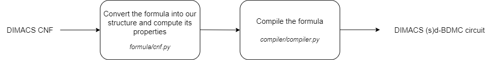

# Cara
**Backdoor Decomposable Monotone Circuits (BDMC) compiler**

## Language
Python 3.8.7 (64 bit)

## Packages
* <a href="https://pypi.org/project/sortedcontainers/" target="_blank">sortedcontainers</a> 2.3.0 (Windows / Linux / Mac)
* <a href="https://pypi.org/project/python-sat/" target="_blank">python-sat</a> 0.1.6.dev11 (Windows / Linux / Mac)
* <a href="https://pypi.org/project/hypernetx/" target="_blank">hypernetx</a> 0.3.7 (Windows / Linux / Mac)

## Software
* <a href="http://glaros.dtc.umn.edu/gkhome/metis/hmetis/overview" target="_blank">hMETIS</a> 1.5.3 (Windows / Linux)
* <a href="https://www.cc.gatech.edu/~umit/software.html" target="_blank">PaToH</a> 3.3 (Linux / Mac)

You can install all required packages to central user packages repository using **pip install --user sortedcontainers==2.3.0 python-sat==0.1.6.dev11 hypernetx==0.3.7**

## Arguments
**Cara [-h] [-ct {D_BDMC,SD_BDMC}] [-ss {MiniSAT,Glucose,Lingeling,CaDiCal}] [-cc {C2D,NONE}] [-il {BCP,IMPLICIT_BCP,BACKBONE,NONE}] [-bc {LITERAL,QUADRATIC,MATCHED,HORN,HIDDEN_HORN,Q_HORN}] [-dd | -sd] [-v]
            input_file output_file**

positional arguments:
* **input_file**
  + The path of the input file which is in the DIMACS CNF format.
* **output_file**
  + The path of the output file where the circuit will be saved.

optional arguments:
+ **-h, --help**
  + show this help message and exit
+ **-ct {D_BDMC,SD_BDMC}, --circuit_type {D_BDMC,SD_BDMC}**
  + The circuit type into which the input formula will be compiled. (default: D_BDMC)
* **-ss {MiniSAT,Glucose,Lingeling,CaDiCal}, --sat_solver {MiniSAT,Glucose,Lingeling,CaDiCal}**
  + The SAT solver which will be used for compiling the circuit. (default: MiniSAT)
* **-cc {C2D,NONE}, --component_caching {C2D,NONE}**
  + Which component caching will be used for compiling the circuit. (default: C2D)
* **-il {BCP,IMPLICIT_BCP,BACKBONE,NONE}, --implied_literals {BCP,IMPLICIT_BCP,BACKBONE,NONE}**
  + Which method will be used for deriving implied literals at every decision node. (default: BCP)
* **-bc {LITERAL,QUADRATIC,MATCHED,HORN,HIDDEN_HORN,Q_HORN}, --base_class {LITERAL,QUADRATIC,MATCHED,HORN,HIDDEN_HORN,Q_HORN}**
  + Which base class will appear in the leaves of the circuit. (default: LITERAL)
* **-dd, --dynamic_decomposition**
  + A dynamic decomposition approach will be used for compiling. (default: True)
* **-sd, --static_decomposition**
  + A static decomposition approach will be used for compiling. (default: False)
* **-v, --version**
  + show program's version number and exit

## High-level overview

## Modules

