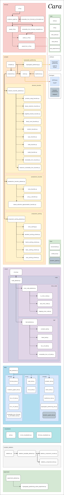

# Cara
**Backdoor Decomposable Monotone Circuits (BDMC) compiler**

## Language
Python 3.6+

## Packages
* <a href="https://pypi.org/project/sortedcontainers/" target="_blank">sortedcontainers</a> 2.3.0 (Windows / Linux / MacOS)
* <a href="https://pypi.org/project/python-sat/" target="_blank">python-sat</a> 0.1.6.dev11 (Windows / Linux / MacOS)
* <a href="https://pypi.org/project/hypernetx/" target="_blank">hypernetx</a> 0.3.7 (Windows / Linux / MacOS)
* <a href="https://pypi.org/project/matplotlib/" target="_blank">matplotlib</a> 3.3.4 (Windows / Linux / MacOS)
* <a href="https://pypi.org/project/numpy/" target="_blank">numpy</a> 1.20.2 (Windows / Linux / MacOS)
* <a href="https://pypi.org/project/kahypar/" target="_blank">kahypar</a> 1.1.6 (Linux / MacOS)

You can install all required packages to central user packages repository using **pip install --user sortedcontainers==2.3.0 python-sat==0.1.6.dev11 hypernetx==0.3.7 matplotlib==3.3.4 numpy==1.20.2 kahypar==1.1.6**

## Software
* <a href="http://glaros.dtc.umn.edu/gkhome/metis/hmetis/overview" target="_blank">hMETIS</a> 1.5.3 (Windows / Linux)
* <a href="https://www.cc.gatech.edu/~umit/software.html" target="_blank">PaToH</a> 3.3 (Linux / MacOS)

## Arguments
Example: *cara -s -bc TWO_CNF -bc RENAMABLE_HORN_CNF input_file output_file*

positional arguments:
* **input_file**
  + path of the input file, which is in the DIMACS CNF format
* **output_file**
  + path of the output file, where the circuit will be saved in the DIMACS NNF format

optional arguments:
+ **-h, --help**
  + show this help message and exit
+ **-s, --smooth**
  + smooth the circuit (default: False)
+ **-p, --preprocessing**
  + find all backbone literals before the compilation (default: False)
* **-bc {TWO_CNF,RENAMABLE_HORN_CNF}, --base_class {TWO_CNF,RENAMABLE_HORN_CNF}**
  + types of base classes in the circuit's leaves (literal leaves are mandatory) (default: None)
* **-hpuf [0.01-0.49], --hp_ub_factor [0.01-0.49]**
  + balance factor that is used for hypergraph partitioning (hMETIS - UB factor, KaHyPar - epsilon) (default: 0.1)
* **-st [non-negative number or None], --subsumption_threshold [non-negative number or None]**
  + threshold (number of clauses) for applying subsumption (None for no limit) (default: 1000)
* **-ncst [0.00-1.00], --new_cut_set_threshold [0.00-1.00]**
  + threshold for computing a new cut set (if the number of implied literals is at least x% of the component's number of variables) (default: 0.1)
* **-ss {MiniSAT,Glucose,Lingeling,CaDiCal}, --sat_solver {MiniSAT,Glucose,Lingeling,CaDiCal}**
  + type of SAT solver that will be used for compiling the circuit (default: MiniSAT)
* **-il {BCP,IMPLICIT_BCP,IMPLICIT_BCP_ITERATION,BACKBONE,NONE}, --implied_literals {BCP,IMPLICIT_BCP,IMPLICIT_BCP_ITERATION,BACKBONE,NONE}**
  + type of method that will be used for deriving implied literals at every decision node (default: BCP)
* **-fil {IMPLICIT_BCP,IMPLICIT_BCP_ITERATION,BACKBONE}, --first_implied_literals {IMPLICIT_BCP,IMPLICIT_BCP_ITERATION,BACKBONE}**
  + type of method that will be used for deriving implied literals after component decomposition (default: IMPLICIT_BCP)
* **-cc {NONE,STANDARD_CACHING_SCHEME,HYBRID_CACHING_SCHEME,BASIC_CACHING_SCHEME}, --component_caching {NONE,STANDARD_CACHING_SCHEME,HYBRID_CACHING_SCHEME,BASIC_CACHING_SCHEME}**
  + type of component caching that will be used for compiling the circuit (default: BASIC_CACHING_SCHEME)
* **-hps {HMETIS,PATOH,KAHYPAR,NONE}, --hp_software {HMETIS,PATOH,KAHYPAR,NONE}**
  + software used for hypergraph partitioning (default: PATOH)
* **-hpc {NONE,ISOMORFISM,ISOMORFISM_VARIANCE}, --hp_caching {NONE,ISOMORFISM,ISOMORFISM_VARIANCE}**
  + type of hypergraph partitioning caching (default: ISOMORFISM)
* **-hplnc [non-negative number or None], --hp_limit_number_of_clauses [non-negative number or None]**
  + threshold (number of clauses) for applying hypergraph partitioning caching (None for no limit) (default: 1000)
* **-hplnv [non-negative number or None], --hp_limit_number_of_variables [non-negative number or None]**
  + threshold (number of variables) for applying hypergraph partitioning caching (None for no limit) (default: 1000)
* **-cstc, --cut_set_try_cache**
  + compute a new cut set at every decision node that satisfies the limits for hypergraph partitioning caching (number of clauses/variables) (default: False)
+ **-hpvs {NONE,EQUIV_SIMPL}, --hp_variable_simplification {NONE,EQUIV_SIMPL}**
  + type of hypergraph partitioning variable simplification (default: EQUIV_SIMPL)
* **-ncstr [0.00-1.00], --new_cut_set_threshold_reduction [0.00-1.00]**
  + if the limits for hypergraph partitioning caching (number of clauses/variables) are satisfied, then the new_cut_set_threshold will be multiplied by x (default: 1)
* **-v, --version**
  + show program's version number and exit
  
## Modules

